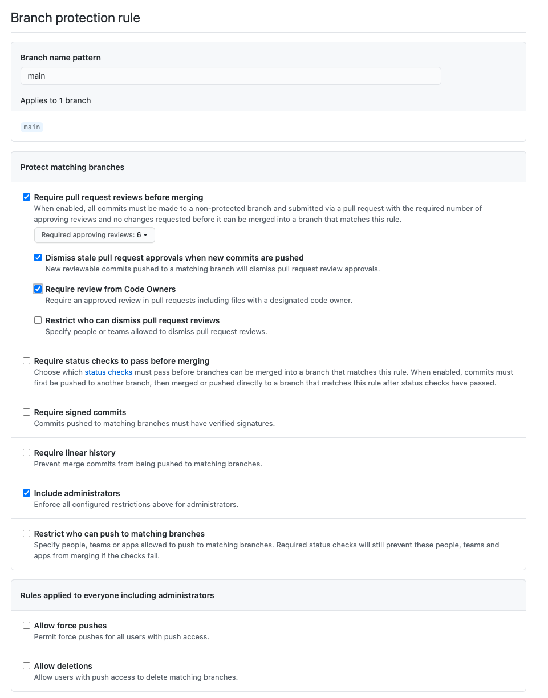

# DevOpsDays Policy Change and Approval Process

## Location of policy documents

The single source of truth for all policies related to devopsdays will be located in the [devopsdays/devopsdays-policies](https://github.com/devopsdays/devopsdays-policies) GitHub repo. Policies are written as Markdown documents.

In case of any discrepancy or disagreement about a policy related to devopsdays, the documents in this repo should be considered the ultimate version.

## Making changes to policies

If a change to a policy is requested, an optional GitHub issue can be opened in the [devopsdays/devopsdays-policies](https://github.com/devopsdays/devopsdays-policies) GitHub repo to discuss it. The creation of an issue is optional, and changes can be proposed directly via a pull request as specified below.

Any proposed changes to a policy document should be proposed via a [pull request](https://docs.github.com/en/free-pro-team@latest/github/collaborating-with-issues-and-pull-requests/about-pull-requests) to the repo. When a policy change is proposed via a pull request, the person making the proposal should email info@devopsdays.org with a link to the pull request, requesting review/comments on the change. 

All policy changes will have a 2 week RFC period, during which comments can be made on the pull request. During the 2 week RFC period, the pull request should be [marked as a "draft"](https://github.blog/2019-02-14-introducing-draft-pull-requests/).  At the end of the 2 week period, the policy enters a one week voting period and the draft status is removed, at which point no further changes should be made to the PR, and all active and advisory core members are invited to vote on the policy change.

### Policy change approvals

For a policy change to be approved, it will require approval on the pull request (using GitHub's built-in approval tools) from a minimum of 6 active or advisory core team members (this is the maximum that branch protection in GitHub allows).

*Note: the submitter of the pull request can not approve their own PR (this is enforced by GitHub).*

If new commits are pushed to the PR, all existing approvals are dismissed.

Even if all required approvals are obtained inside the pull request prior to the end of the RFC period, this will not constitute approval. Once the RFC period has ended, the policy may be merged at any time once the requisite approvals have been granted.

## Repository and Pull Request configuration

All policies will be stored in the `/policies` folder inside the repository.

The “main” branch of the `devopsdays/devopsdays-policies` repository will be configured to not allow merges without a minimum of 6 approvals from [CODEOWNERS](https://github.com/devopsdays/devopsdays-policies/blob/main/.github/CODEOWNERS), and configured to dismiss approvals if new commits are pushed to the pull request. This branch protection will also be extended to include administrators.

The repository will be configured with a [`CODEOWNERS` file](https://docs.github.com/en/free-pro-team@latest/github/creating-cloning-and-archiving-repositories/about-code-owners) to include all files in the repo, with a group that includes all active and advisory core team members, so that they are automatically requested to review the pull request.

### CODEOWNERS configuration

The default owners of the entire repository will be [@devopsdays/core-active](https://github.com/orgs/devopsdays/teams/core-active) and [@devopsdays/core-advisory](https://github.com/orgs/devopsdays/teams/core-advisory). The `CODEOWNERS` file should look like this:

```
*       @devopsdays/core-active @devopsdays/core-advisory
```

### Branch Protection rules for `main` branch

The `main` branch for the `devopsdays/devopsdays-policies` repository should be configured with the following branch protection rules:

- Require 6 pull request reviews before merging
- Dismiss stale pull request approvals when new commits are pushed
- Require review from Code Owners
- Include administrators


